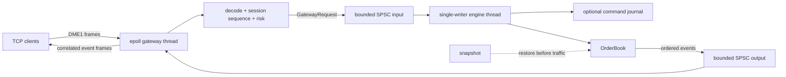

# Deterministic Matching Engine: Design and Correctness

This document explains why the engine is structured as it is, which invariants
make it correct, where work and memory are bounded, and which claims the current
tests and benchmarks actually support. It is intended to be useful to a reviewer
who wants to audit the system rather than only run it.

The exact network encoding is specified separately in
[PROTOCOL.md](PROTOCOL.md). Reproducible measurements and their limitations are
recorded in [BENCHMARK_RESULTS.md](../BENCHMARK_RESULTS.md).

### Review map

| If you are reviewing... | Start here |
|---|---|
| Matching correctness | [Book invariants](#5-book-invariants) and [command semantics](#6-command-semantics-and-event-order) |
| Latency design | [Representation](#4-order-book-representation), [bounds](#7-work-and-memory-bounds), and [benchmarks](#14-benchmark-methodology-and-claim-boundaries) |
| Concurrency | [Sequence domains](#3-sequence-domains-and-determinism) and [backpressure](#8-concurrency-and-backpressure) |
| Network safety | [Gateway boundary](#9-gateway-and-protocol-boundary) and [failure semantics](#11-failure-semantics) |
| Recovery | [Persistence and recovery](#10-persistence-and-recovery) |
| Evidence | [Verification](#13-verification-strategy) and [claim matrix](#15-claim-to-evidence-matrix) |

## 1. Goals and non-goals

### Goals

- Deterministic price-time matching for limit, market, immediate-or-cancel (IOC),
  and fill-or-kill (FOK) orders.
- A single authoritative mutation order, expressed by contiguous engine sequence
  numbers.
- No allocation by book storage after construction.
- Fixed-capacity order lookup and intrusive per-price FIFO queues.
- Explicit backpressure between network, engine, and publication threads.
- A portable matching core and a Linux reference TCP gateway.
- Replayable command history and replace-at-destination snapshots.
- Performance claims tied to named workloads, machines, and verification evidence.

### Non-goals

- A production exchange, broker, or complete order-management system.
- Multi-writer mutation of one book. Horizontal scale is expected through
  instrument sharding, not locks inside an `OrderBook`.
- Authentication, authorization, TLS, account management, or regulatory controls.
- Kernel bypass, multicast market-data publication, or replicated consensus.
- A guarantee that `std::ofstream::flush()` has forced data to physical media.
- A wire-to-wire latency claim. Published percentiles measure in-process
  components.

## 2. System boundaries and data flow

The design separates socket ownership, book ownership, and response publication.
Only the engine thread mutates an order book.



The reference executable has two long-lived threads:

1. The gateway thread owns the listening socket, `epoll` instance, client
   sockets, connection buffers, session validators, and session-to-socket map.
2. The engine thread owns the book mutation order and assigns engine sequences.

This ownership model is the primary synchronization mechanism. Shared work crosses
the boundary only through one-producer/one-consumer queues.

## 3. Sequence domains and determinism

The system intentionally uses two different sequence domains.

| Domain | Owner | Purpose |
|---|---|---|
| Client sequence | One TCP session | Detect duplicate, missing, or reordered requests from that client |
| Engine sequence | Single-writer runner | Define one total mutation order across all admitted sessions |

The first request on a connection binds a nonzero session ID. Client sequence must
start at 1 and remain contiguous. A syntactically valid request consumes its client
sequence even when risk or gateway backpressure rejects it; retrying that sequence
would otherwise make the server ambiguous about whether the first attempt was
observed.

After gateway validation, `GatewayEngineRunner` overwrites the command's unused
sequence field with the next engine sequence. `OrderBook::process` accepts only
`last_sequence + 1`. A gap is rejected without advancing book sequence, so the
missing command remains recoverable rather than being silently skipped.

Given the same configuration and engine-sequenced command stream, the book produces
the same ordered event stream and final state. Wall-clock time, thread IDs, random
numbers, and floating-point values never enter matching decisions.

## 4. Order-book representation

Let:

- `P = ((maximum_price - minimum_price) / tick_size) + 1`, the configured number
  of price ticks;
- `N = maximum_orders`, the maximum number of resting orders;
- `W = ceil(P / 64)`, the number of activity-bitmap words.

Construction allocates the following structures once:

| Structure | Size | Role |
|---|---:|---|
| Bid and ask ladders | `2P` price levels | Aggregate quantity and FIFO endpoints |
| Bid and ask activity bitmaps | `2W` words | Identify nonempty price levels |
| Order-node arena | `N` nodes | Stable indexed storage for resting orders |
| Free-node stack | `N` indices | Constant-time node acquisition/recycling |
| Fixed order-ID index | next power of two at least `2N` | ID-to-node lookup at at most 50% planned load |

```text
active bitmap ──► price level ──► head node ──► next node ──► tail node
                      │                ▲                           ▲
                      └─ total qty     │                           │
                                       └──── order-node arena ─────┘
                                                  ▲
order ID ──► fixed open-addressed index ──────────┘
unused arena indices ◄── free-node stack
```

### 4.1 Contiguous price ladders

A valid price maps directly to:

```text
index = (price - minimum_price) / tick_size
price = minimum_price + index * tick_size
```

This replaces tree traversal and per-level allocation with arithmetic and contiguous
memory. The tradeoff is proportional memory consumption across the configured price
range, including empty ticks. The approach is appropriate when the instrument's
tick range is known and reasonably dense.

### 4.2 Active-price bitmaps

Each active price sets one bit. Best ask scans bitmap words from low to high and
uses `countr_zero`; best bid scans high to low and uses `countl_zero`.

This is bounded bitmap discovery, not an unqualified O(1) claim. Worst-case work is
`W` word inspections. A wider ladder can increase that bound. A hierarchical bitmap
would reduce the scan for very wide sparse ladders at the cost of extra state and
updates; the current one-level design was chosen for simplicity and measured
performance on the configured range.

### 4.3 Intrusive FIFO at each price

Every price level stores `head`, `tail`, `count`, and aggregate quantity. Each node
stores previous and next arena indices. Adding a resting order appends to the tail;
matching always consumes the head. Removal relinks neighboring indices without a
heap operation.

The FIFO is therefore the source of time priority. `RestingOrder::priority` is also
persisted so snapshot restoration can reconstruct queue order.

### 4.4 Fixed order-ID index

`FixedOrderIndex` uses a power-of-two open-addressed table, SplitMix-style integer
mixing, and linear probing. The table is sized to at least twice the requested order
capacity, keeping planned occupancy at or below 50%.

Deletion closes the probe-chain hole by removing and reinserting the following
cluster. This avoids tombstones accumulating during long cancel/replace sessions and
preserves the rule that lookup may stop at the first empty slot. Expected lookup is
constant time at the planned load; adversarial collisions and cluster repair remain
O(N) worst cases and are not described as deterministic constant time.

## 5. Book invariants

These properties must hold after every accepted command:

1. Every live order ID appears exactly once in the fixed index and maps to exactly
   one live arena node.
2. Every live node belongs to exactly one price-level FIFO matching its side and
   price.
3. A level's `head` and `tail` are both invalid exactly when `count == 0`.
4. A level's aggregate quantity equals the sum of `remaining` across its FIFO.
5. An activity bit is set exactly when its corresponding level is nonempty.
6. The free-node stack and live nodes partition the arena.
7. `stats.resting_orders` equals the number of indexed live nodes.
8. FIFO order at a price is increasing admission priority; a successful replace
   loses the original position.
9. Trades execute at the resting order's price, never the aggressor's submitted
   price.
10. `last_sequence` advances only for the next contiguous engine sequence.

The implementation centralizes structural changes in `add_resting` and
`remove_node`, reducing the number of functions that can violate these invariants.
The differential test independently checks event streams and periodically compares
observable book state, rather than duplicating these internal data structures.

## 6. Command semantics and event order

Events are appended in deterministic order to caller-owned storage.

| Command | Success event order | Important rejection behavior |
|---|---|---|
| New limit | `Accepted`, zero or more `Trade`, optional `Rested` | Invalid quantity/price, duplicate ID, or capacity |
| New market | `Accepted`, zero or more `Trade`, optional `Cancelled` remainder | Quantity and duplicate-ID rules still apply |
| IOC | `Accepted`, zero or more `Trade`, optional `Cancelled` remainder | Never rests |
| FOK | `Accepted`, then trades | `WouldNotFill` occurs before mutation and before `Accepted` |
| Cancel | `Cancelled` | Unknown ID leaves state unchanged |
| Replace | `Replaced`, then trades or `Rested` | Invalid replacement leaves the original order unchanged |

### 6.1 Matching

An aggressor repeatedly discovers the best opposite price, verifies that it
crosses its effective limit, and trades against the FIFO head. A partial fill
reduces both node and level quantities. A complete fill unlinks and recycles the
resting node. Market orders use the configured ladder boundary as their effective
limit.

### 6.2 Fill-or-kill preflight

FOK calls `can_fully_fill` before emitting acceptance or changing state. The scan
adds eligible level quantities until the requested quantity is available or the
limit is exhausted. Only then does normal matching begin. Because the book is
single-writer, nothing can invalidate the preflight between its check and execution.

### 6.3 Replace priority

A valid replace first records the original side, removes the old node, emits
`Replaced`, and submits a new limit order with the command's new price and quantity.
It appends at the destination level's tail and uses the replacement engine sequence
as its new priority. Side cannot be changed by replacement.

### 6.4 Full-book executable orders

Resting capacity does not automatically reject an incoming order: a limit order
that can fully execute is still admitted while the arena is full. The current
precheck conservatively rejects a limit order that cannot fully execute when no node
is available, even if partial execution might have freed a node for its remainder.
That preserves state on rejection and keeps the capacity decision simple, at the
cost of rejecting some executable partial-fill cases.

## 7. Work and memory bounds

The table states algorithmic bounds honestly; expected hash behavior is separated
from worst-case behavior.

| Operation | Work bound | Allocation after book construction |
|---|---|---|
| Price validation/indexing | O(1) | None |
| Best bid/ask | O(W) worst case | None |
| ID lookup/insert | Expected O(1), O(N) worst case | None |
| Cancel | Expected O(1), O(N) worst case during cluster repair | None |
| Add to a known level | Expected O(1) | None |
| Match command | O(F x W) upper form for `F` fill iterations, plus hash removals | None in book storage |
| FOK preflight | O(P) worst case | None |
| Snapshot enumeration | O(P + N) | Allocates returned snapshot vector |

`OrderBook` does not own event storage. `process` appends to a caller-supplied
`std::vector<Event>`; callers that require an allocation-free path must reserve for
their maximum possible event fanout. The runners reserve 64 and 256 events
respectively, but a command sweeping more resting orders can make those vectors
grow. This is a deliberate, visible contract rather than a blanket zero-allocation
claim.

Overall book memory is O(P + N). The configured fixed capacity converts exhaustion
into an explicit `BookCapacity` rejection instead of an allocator stall.

## 8. Concurrency and backpressure

### 8.1 Single-writer book

`OrderBook` is not thread-safe and contains no locks. Exactly one thread owns all
mutation. Read-side publication should consume immutable event copies or an external
snapshot rather than concurrently inspect live internals.

For multiple instruments, the intended scale-out unit is one runner/book per shard.
An upstream router can use instrument identity to choose the owning queue. This keeps
each book's mutation order local and removes cross-core cache-line contention.

### 8.2 SPSC queue memory ordering

`SpscQueue<T>` uses a power-of-two ring with one sentinel slot:

- The producer is the sole writer of `tail`; it reads that index relaxed.
- After writing a slot, the producer release-stores the new `tail`.
- The consumer acquire-loads `tail` before reading the published slot.
- The consumer is the sole writer of `head`; after consuming a slot it
  release-stores the new `head`.
- The producer acquire-loads `head` before reusing freed storage.

The release/acquire pairs prevent a consumer from observing an advanced index before
the slot contents and prevent a producer from reusing a slot before consumption.
`head` and `tail` are independently `alignas(64)`; MSVC's padding warning is disabled
specifically because this separation is intentional.

The contract is exactly one producer and one consumer. The queue does not support
multiple writers, multiple readers, blocking waits, or dynamic growth.

### 8.3 Backpressure policy

Backpressure is never silently converted into an unbounded allocation:

| Boundary | Full-buffer behavior |
|---|---|
| Gateway to engine request queue | Return `GatewayBackpressure` rejection when transmit space permits |
| Engine to gateway response queue | Engine yields and retries; generated events are not silently dropped |
| Per-connection transmit buffer | Disconnect the slow reader if another complete response cannot fit |
| Per-connection receive buffer | Decode/compact complete frames; disconnect only if an unconsumable frame fills the buffer |

The engine's retry policy preserves responses but allows a slow publisher to stall
book progress. That is an explicit consistency-over-availability choice for this
reference system.

## 9. Gateway and protocol boundary

The Linux gateway uses level-triggered `epoll` with nonblocking, close-on-exec
sockets. Each `Connection` owns fixed 64 KiB receive and 256 KiB transmit arrays.
TCP fragmentation and coalescence are handled by retaining incomplete bytes,
decoding as many complete frames as possible, and compacting the remainder.

The binary codec writes and reads fields explicitly in little-endian order. It does
not serialize C++ object representations, so compiler padding cannot alter the wire
format. All frames share magic, version, type, total length, session, and client
sequence fields. See [PROTOCOL.md](PROTOCOL.md) for byte offsets.

### 9.1 Validation order

1. Validate framing: magic, version, length, type, and required identity fields.
2. Bind or verify the connection's session.
3. Require the exact next client sequence.
4. Apply quantity, price, and overflow-safe notional limits.
5. Attempt to enqueue the request for the engine.

Market requests are quantity-limited but skip submitted-price/notional checks because
their execution price is determined by available resting liquidity. A production
risk engine would normally add collars, reference prices, positions, credit, and
account-specific policy.

Malformed protocol closes the connection. Session, risk, and request-queue failures
produce correlated rejection events when output space remains. Gateway-originated
rejections have engine sequence zero because they never entered the global mutation
order.

Only the gateway thread touches connection maps and buffers. Only the engine thread
touches the book. Responses carry session and client sequence on every event so the
gateway can route multiple events from one command without shared book state.

### 9.2 Reference-executable limits

The executable currently uses:

- one book spanning prices 9,000 through 11,000 at tick size 1;
- capacity for 1,000,000 resting orders;
- a requested minimum request capacity of 65,536 (131,071 usable ring slots after
  sentinel-aware power-of-two rounding);
- a requested minimum response capacity of 262,144 (524,287 usable ring slots);
- default risk maximums of quantity 1,000,000, submitted price 1,000,000,000,
  and notional 100,000,000,000. The narrower book range remains authoritative for
  limit-order price validity.

It listens on all interfaces and does not enable the optional command journal. These
defaults make the executable demonstrable, not deployment-ready. Configuration,
instrument routing, identity, encrypted transport, and operational limits belong in
the next layer.

On `SIGINT` or `SIGTERM`, the event loop stops and joins the engine thread. Shutdown
does not promise to drain every queued request or socket byte; a production service
would use a staged quiesce-and-drain protocol.

## 10. Persistence and recovery

Persistence has two complementary forms.

### 10.1 Command journal

The optional runner journal writes a versioned header followed by fixed-size native
`Command` records and a 64-bit FNV-1a-style checksum. A runner appends before calling
`OrderBook::process`, so replay sees every engine-sequenced command presented to the
book, including commands the book deterministically rejects.

Replay validates the header and each record, stops at the first incomplete or
checksum-invalid record, and returns `valid_bytes`. An operator can retain or
truncate that verified prefix before accepting new traffic.

The checksum detects accidental corruption; it is not cryptographic. Journal records
are native same-build recovery structures, not portable protocol messages.

### 10.2 Snapshot

A snapshot stores configuration, last engine sequence, resting orders, priorities,
and a checksum. Writing occurs to `path.tmp`; the completed temporary file replaces
the destination. Windows uses `MoveFileExW` with replacement and write-through flags;
other platforms use filesystem rename semantics.

Restore is allowed only into a new empty book. It validates price, quantity, order
identity, capacity, and priority, stable-sorts by priority, then rebuilds the FIFOs
through the same `add_resting` path used during live operation.

### 10.3 Recovery procedure

An application-level recovery sequence is:

1. Load and validate the latest snapshot.
2. Replay journal records whose sequence is greater than the snapshot sequence.
3. Stop at the first corrupt/torn journal record and retain its verified prefix.
4. Resume the runner at `book.stats().last_sequence + 1`.
5. Admit network traffic only after recovery completes.

The repository provides the primitives but does not yet bundle snapshot and journal
selection into one orchestration executable.

### 10.4 Durability levels

| Mode | What it establishes | What it does not establish |
|---|---|---|
| Buffered append | Record passed to the C++ stream | OS receipt or media persistence |
| `synchronous=true` | C++ stream flushed after each record | `fdatasync`, disk-cache flush, replication, or consensus |
| Snapshot replacement | Readers do not observe a partially written destination file under normal filesystem semantics | Cross-device atomicity or replicated durability |

No benchmark or resume statement should reinterpret buffered journal throughput as
durable-ack performance.

## 11. Failure semantics

| Failure | Observable behavior | State mutation |
|---|---|---|
| Engine sequence gap | `Rejected(SequenceGap)` | None; expected sequence remains missing |
| Invalid quantity/price | Rejection event | None |
| Duplicate/unknown order ID | Rejection event | None |
| FOK insufficient liquidity | `Rejected(WouldNotFill)` | None |
| Resting capacity unavailable | `Rejected(BookCapacity)` | None |
| Wrong session/client sequence | Gateway rejection | No engine sequence assigned |
| Risk limit | Gateway rejection; valid client sequence consumed | No engine sequence assigned |
| Request queue full | Gateway backpressure rejection | No engine sequence assigned |
| Malformed frame | Connection closed | None |
| Slow reader/transmit overflow | Connection closed | Prior engine mutation is retained |
| Torn/corrupt journal tail | Replay stops and reports verified prefix | Caller decides truncation/recovery policy |
| Corrupt snapshot | Exception; snapshot is not restored | None |

The slow-reader case is important: network delivery is not transactional with book
mutation. Production systems need client recovery by sequence, replayable outbound
events, or another acknowledgement protocol.

## 12. Key design decisions and alternatives

| Decision | Why it was chosen | Rejected/deferrable alternative |
|---|---|---|
| Single writer per book | One total order, no locks, simpler invariants | Fine-grained locking or concurrent mutation |
| Contiguous ladders | Direct indexing and no level allocation | `std::map`, heap, radix tree |
| One-level active bitmap | Compact and simple bounded best-price search | Hierarchical bitmap for wider sparse ranges |
| Intrusive arena-index FIFO | Stable storage and O(1) unlink | Node containers and allocator-dependent latency |
| Fixed open-addressed ID index | Preallocated, cache-friendly lookup | `std::unordered_map` node allocation |
| Cluster repair on erase | No long-session tombstone buildup | Tombstones with periodic rebuild |
| Caller-owned event vector | Simple API with visible fanout responsibility | Fixed event batch that can truncate or reject sweeps |
| Bounded SPSC queues | Explicit capacity and ownership | Unbounded queues or hidden allocation |
| Explicit wire codec | Stable byte order and validation | Raw struct serialization |
| Separate client/engine sequences | Per-session recovery plus global determinism | Trust client sequences as global order |
| Journal before process | Replay reproduces deterministic rejections too | Journal only accepted mutations |

## 13. Verification strategy

Correctness evidence is layered so one implementation mistake is unlikely to fool
every test.

### Focused tests

Fifteen focused cases cover price-time priority, best-price selection, partial fills,
cancel/replace priority loss, IOC/FOK semantics, sequence and capacity rejection,
snapshot/journal recovery, SPSC ordering, protocol fragmentation/malformed fields,
session/risk validation, and gateway event correlation.

### Independent differential model

`tests/test_differential.cpp` implements a deliberately slower linear-scan reference
book using different data structures. It generates 50,000 deterministic randomized
commands across new, market, IOC, FOK, cancel, and replace behavior. Every produced
event is compared, and observable book state is compared periodically.

The value is independence: comparing two copies of the production algorithm would
mainly prove that the same bug was written twice.

### Malformed-frame testing

The same suite sends 100,000 deterministic randomized byte buffers to both request
and response decoders. Focused protocol tests additionally verify every incomplete
prefix returns `NeedMoreData` and corrupt headers/enum fields are rejected.

This is high-volume fuzz-style testing, not a coverage-guided libFuzzer campaign.
That distinction is kept explicit.

### Thread and stream integration

The SPSC test transfers 200,000 ordered values across threads. On Linux, the socket
integration test fragments a request and two responses across an `AF_UNIX`
`SOCK_STREAM`, then validates session, engine, codec, correlation, and reassembly
behavior. CI also compiles the Linux `epoll` executable.

The current integration test does not launch the TCP listener or drive `epoll`
through a real client connection; that remains a useful future test target.

### CI and sanitizers

GitHub Actions performs warnings-as-errors release builds and tests on Linux and
Windows. A separate Linux Clang job runs AddressSanitizer and
UndefinedBehaviorSanitizer across all Linux tests. The project keeps tests
dependency-free so the verification path does not depend on a testing framework.

## 14. Benchmark methodology and claim boundaries

`dme_bench` contains five matching scenarios plus protocol, SPSC, and journal
throughput workloads:

- crossing IOC;
- insert/cancel churn;
- replace priority churn;
- nine-level market sweep;
- mixed lifecycle;
- protocol encode/decode;
- SPSC cross-thread transfer;
- buffered journal append.

Core scenarios construct and warm the book outside timed loops. Latency sampling
uses `steady_clock` and therefore includes measurement cost. The documented Windows
clock quantizes samples to 100 ns, so the results cannot distinguish sub-100-ns
changes. CPU affinity success is printed rather than assumed.

The supported headline—17.70M operations/second median, 100 ns p50, and 600 ns
worst-trial p99.9—belongs only to the named crossing-core workload and the exact
nine-trial environment in [BENCHMARK_RESULTS.md](../BENCHMARK_RESULTS.md). It excludes
socket I/O, gateway queueing, risk, response publication, and physical-media
synchronization.

## 15. Claim-to-evidence matrix

| Claim | Evidence | Boundary |
|---|---|---|
| Price-time priority | Focused FIFO tests plus differential model | One configured book |
| Deterministic processing | Contiguous engine sequence enforcement and repeatable differential stream | Assumes identical configuration/input |
| Allocation-free book storage after construction | Preallocated ladders, arena, free stack, and fixed index | Event vector and persistence APIs may allocate |
| Lock-free-style inter-thread transport | SPSC acquire/release implementation and 200,000-value thread test | Exactly one producer/consumer; lock freedom depends on target `size_t` atomics; not wait-free |
| Fragment-safe binary protocol | Prefix tests, malformed-frame tests, and stream integration | No TLS/authentication |
| Recovery from torn journal tail | Checksummed record replay test | Caller must apply truncation policy |
| Cross-platform core | Linux and Windows warnings-as-errors CI | TCP gateway is Linux-only |
| Reported core throughput/latency | Checked-in raw nine-trial results and reproducible harness | Not end-to-end or durable latency |

## 16. Code map and ownership contracts

| Path | Responsibility | Ownership/thread contract |
|---|---|---|
| `include/dme/order_book.hpp`, `src/order_book.cpp` | Matching, ladders, FIFO, arena | One writer |
| `include/dme/fixed_hash.hpp` | Fixed ID-to-node index | Book-owning thread |
| `include/dme/spsc_queue.hpp` | Bounded cross-thread transport | Exactly one producer/consumer |
| `include/dme/engine_runner.hpp` | Generic command/event loop | Owns book mutation while running |
| `include/dme/gateway.hpp`, `src/gateway.cpp` | Session/risk validation and correlated runner | Gateway validates; engine mutates |
| `include/dme/protocol.hpp`, `src/protocol.cpp` | Explicit DME1 codec | Stateless/reentrant |
| `apps/gateway.cpp` | Linux sockets, `epoll`, buffers, routing | One network thread owns connections |
| `include/dme/journal.hpp`, `src/journal.cpp` | Journal, replay, snapshot | External serialization required for concurrent use |
| `apps/benchmark.cpp` | Component workload harness | Single benchmark owner plus SPSC worker |
| `tests/` | Focused, differential, malformed-input, stream tests | Deterministic test inputs |

## 17. Production-hardening path

The most valuable next steps are architectural rather than cosmetic:

1. Add instrument/account routing and one engine shard per owning core.
2. Add TLS/authentication outside the matching thread and load controlled
   per-account risk policy.
3. Add a staged shutdown protocol that stops admission, drains queues, publishes
   final responses, and records a recovery point.
4. Add durable sequence-aware outbound replay so a disconnected client can recover
   events after an already-committed mutation.
5. Replace stream-only integration with a launched TCP/`epoll` black-box test and
   run coverage-guided fuzzing against codecs and recovery formats.
6. Define a portable versioned persistence schema and a measured `fdatasync` or
   replicated durability policy.
7. Add hierarchical bitmaps if real instrument configurations demonstrate that
   one-level scans dominate tail latency.
8. Measure controlled client-to-client and durable-ack latency before making either
   claim.

The current design deliberately exposes these boundaries. A low-latency system is
credible not because it labels every path constant-time or production-ready, but
because its ownership, failure modes, work bounds, and evidence are reviewable.
